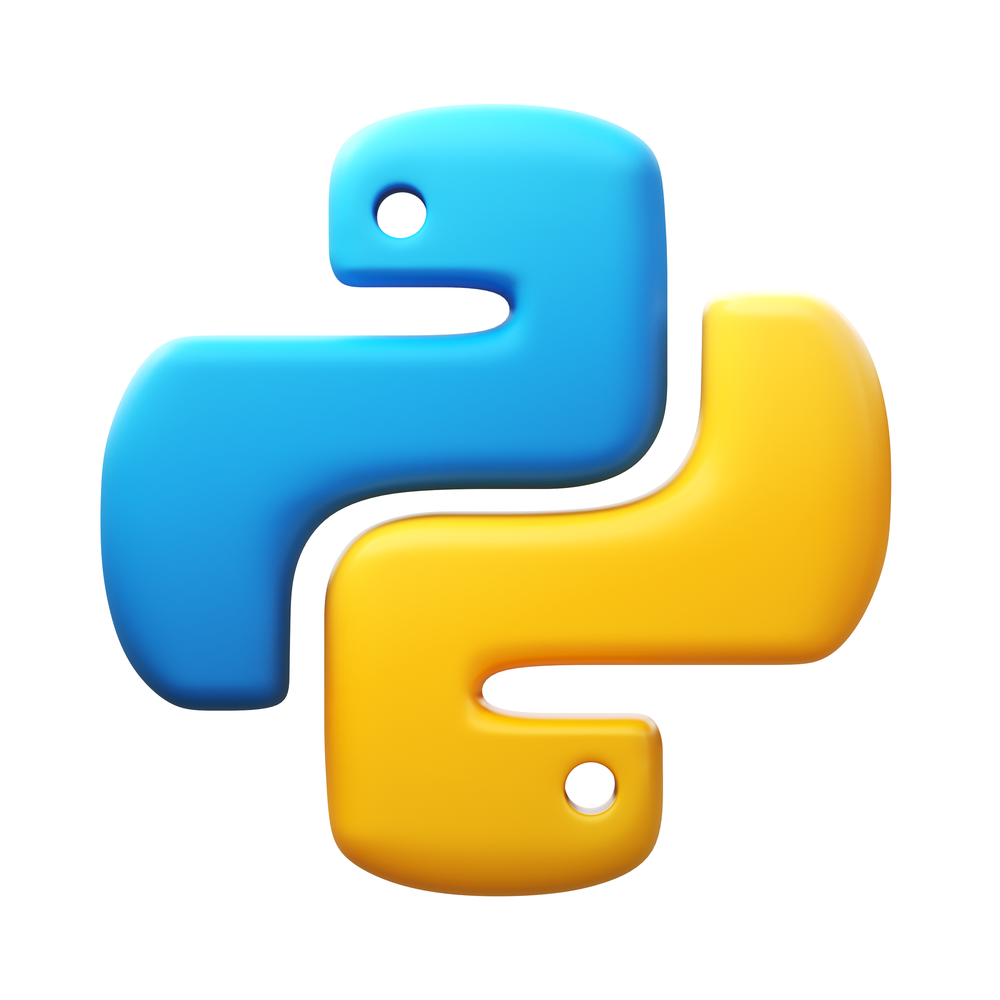

## Olá, tudo bom? :mage_man:
Meu nome é João Vytor Siebra, tenho 26 anos, Pernambucano e sou aspirante na área de Engenharia de Dados, estudando atualmente DE no Santander Coders e DIO, além de cursar Análise e Desenvolvimento de Sistemas. 

Estou aprendendo python e pretendo desenvolver projetos desafiadores e relevantes para sociedade.

  

### Minhas Skills:

<!--
**vytorsiebra/vytorsiebra** is a ✨ _special_ ✨ repository because its `README.md` (this file) appears on your GitHub profile.

Here are some ideas to get you started:

- 🔭 I’m currently working on ...
- 🌱 I’m currently learning ...
- 👯 I’m looking to collaborate on ...
- 🤔 I’m looking for help with ...
- 💬 Ask me about ...
- 📫 How to reach me: ...
- 😄 Pronouns: ...
- ⚡ Fun fact: ...
-->
